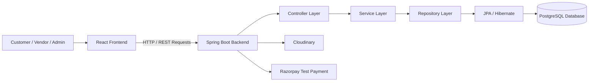
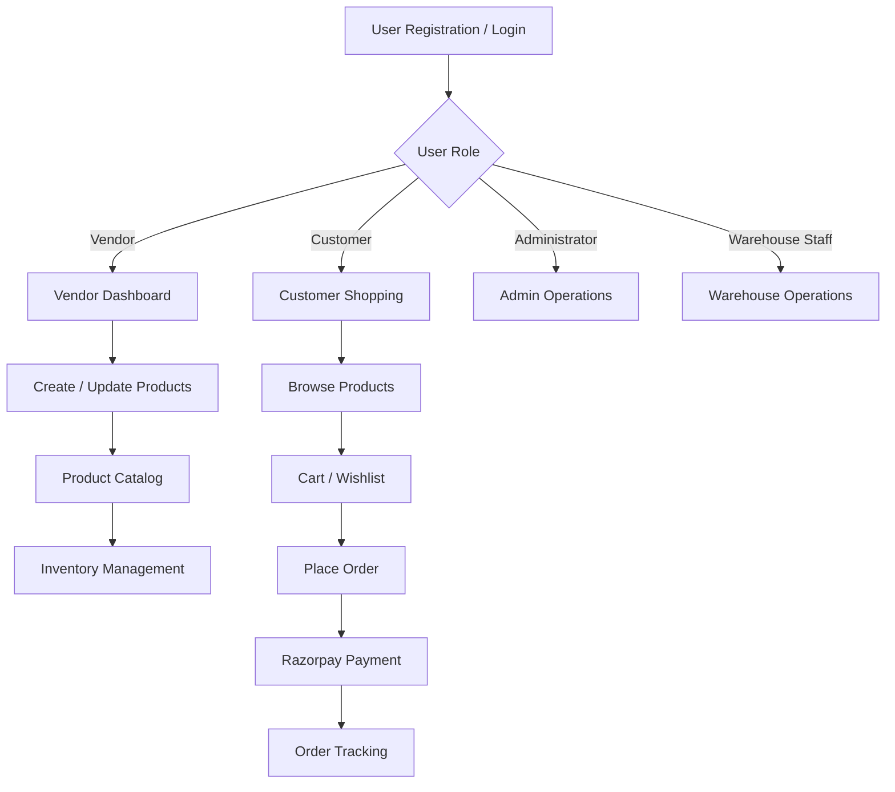
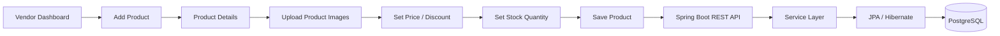
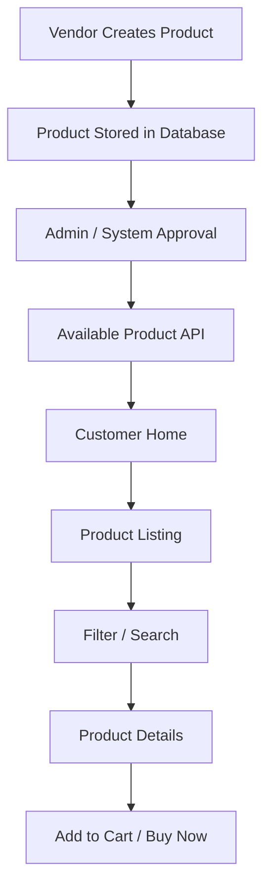
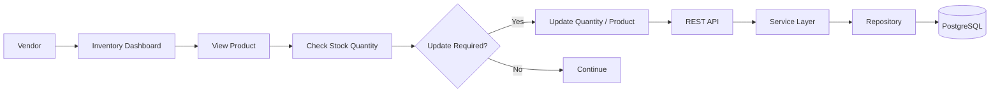
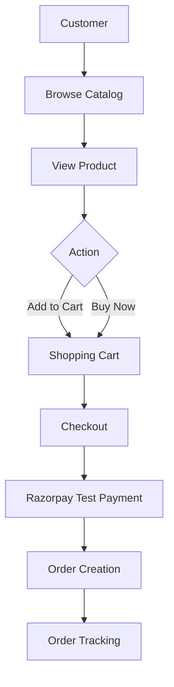

# ShopStack — Enterprise Multi-Vendor E-Commerce Platform

## Pull Request Overview

This pull request integrates **ShopStack**, a full-stack multi-vendor e-commerce platform, into the repository.

The application follows a layered backend architecture with a React-based frontend, Spring Boot REST APIs, JPA/Hibernate persistence, and PostgreSQL database integration. The platform supports multiple user roles and provides complete workflows for product management, inventory, customer shopping, ordering, and payment processing.

---

## 1. System Architecture



### Architecture Flow

**User Interface → React → REST API → Spring Boot → Service Layer → Repository → JPA/Hibernate → PostgreSQL**

This separation enables the application to maintain clear responsibilities between presentation, business logic, API handling, and data persistence.

---

# 2. Core Platform Workflow



---

# 3. Vendor Product Management

The vendor module enables vendors to manage the products that are published on the platform.



### Product Management Responsibilities

Vendors can manage:

* Product name
* Product description
* Product type/category
* Product images
* Stock quantity
* Price and discount price
* Product availability

The platform also maintains product states such as:

```text
PENDING → APPROVED → AVAILABLE
              ↓
           REJECTED
```

This provides a controlled product publishing workflow before products become visible to customers.

---

# 4. Product Catalog

The product catalog acts as the customer-facing product discovery layer.



Customers can view products based on availability and applicable inventory conditions.

The catalog supports filtering based on criteria such as:

* Price range
* Category
* Brand
* Minimum stock
* Rating

---

# 5. Inventory Management

Inventory management is integrated into the vendor workflow to maintain product stock information.



The inventory workflow allows vendors to monitor and update product stock so that customer-facing product availability remains synchronized with the stored inventory.

---

# 6. Customer Shopping Workflow



The customer workflow connects product discovery, cart management, checkout, payment processing, and order tracking into a unified transaction flow.

---

# 7. Backend Request Lifecycle

A typical request follows the layered architecture below:

```text
React Frontend
      ↓
HTTP Request
      ↓
REST Controller
      ↓
Service Layer
      ↓
Repository
      ↓
JPA / Hibernate
      ↓
PostgreSQL
      ↓
Database Response
      ↓
Entity / Java Object
      ↓
REST Response
      ↓
JSON
      ↓
React UI
```

This approach isolates business logic from database access and keeps the application modular and maintainable.

---

# 8. Technology Stack

| Layer               | Technology         |
| ------------------- | ------------------ |
| Frontend            | React              |
| Backend             | Java, Spring Boot  |
| API                 | REST APIs / HTTP   |
| Persistence         | JPA / Hibernate    |
| Database            | PostgreSQL         |
| Image Management    | Cloudinary         |
| Payment Integration | Razorpay Test Mode |
| Deployment          | Vercel + Render    |

---

# 9. Major Functional Modules

```text
                         SHOPSTACK
                            │
        ┌───────────────────┼───────────────────┐
        │                   │                   │
      USERS              PRODUCTS            ORDERS
        │                   │                   │
   ┌────┴────┐        ┌─────┴─────┐       ┌────┴─────┐
   │         │        │           │       │          │
Customer  Vendor   Catalog    Inventory  Checkout  Tracking
             │
             └── Product Management
```

The platform is organized around role-based and domain-specific modules to support scalability and maintainability.

---

# 10. My Contribution

As part of the development team, my primary contribution focused on the **vendor-side product lifecycle**, particularly:

```text
Vendor
  ↓
Product Creation
  ↓
Product Catalog
  ↓
Inventory Management
  ↓
Product Availability
  ↓
Customer Visibility
```

I worked on the vendor workflow for creating and managing products, maintaining product information and stock details, and integrating these operations with the backend APIs and database layer.

---

# 11. Engineering Highlights

* Full-stack integration between React and Spring Boot
* REST-based communication between frontend and backend
* Layered backend architecture
* JPA/Hibernate-based ORM and PostgreSQL persistence
* Multi-role application design
* Vendor product lifecycle management
* Inventory and availability handling
* Cloudinary-based product image management
* Razorpay test-mode payment integration
* Order management and tracking
* Production deployment configuration
* CORS and frontend-backend integration for deployed environments

---

## 12. Pull Request Scope

This pull request introduces the complete **ShopStack application and its associated implementation**, including backend services, frontend components, database integration, product workflows, inventory management, customer shopping functionality, payment integration, and deployment-related configuration.

The implementation is intended to provide a structured foundation for further enterprise-level enhancements and modular feature development.
