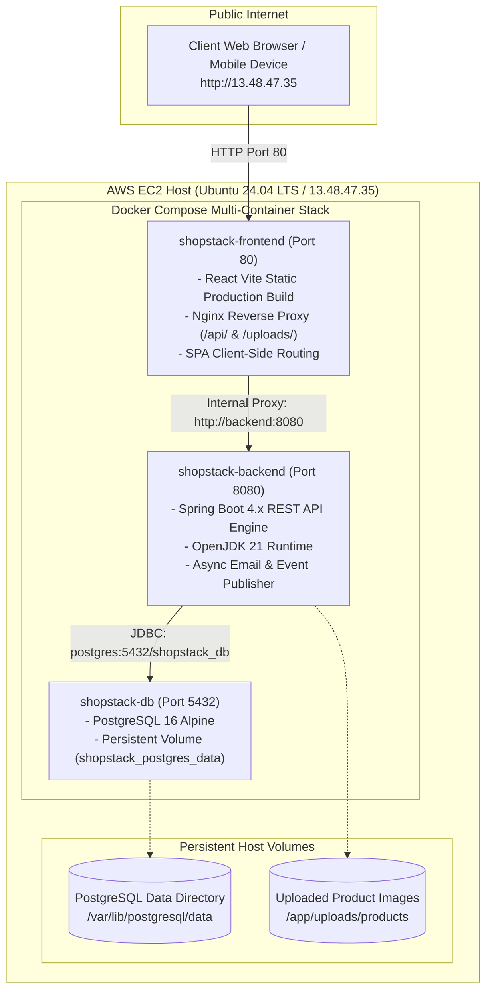

# 🌐 ShopStack — AWS Cloud Deployment Guide (Day 16 Milestone)

This comprehensive guide details the step-by-step process used to containerize the **ShopStack Multi-Vendor E-Commerce Platform** using **Docker & Docker Compose** and deploy it to **Amazon Web Services (AWS) EC2** with a publicly accessible URL.

---

## 📌 Architecture Overview



---

## 🛠️ Step-by-Step Deployment Process

### 1. AWS EC2 Instance Setup
1. Launch an **Ubuntu 22.04 or 24.04 LTS** instance (`t3.small` / `t2.medium` recommended).
2. Configure AWS **Security Group Inbound Rules**:
   - **HTTP (Port 80)**: Source `0.0.0.0/0` (Storefront UI & Nginx Reverse Proxy)
   - **HTTPS (Port 443)**: Source `0.0.0.0/0` (SSL/TLS Traffic)
   - **SSH (Port 22)**: Source `0.0.0.0/0` or your IP (Terminal Administration)
   - **Custom TCP (Port 8080)**: Source `0.0.0.0/0` (Backend API direct access)
3. Allocate an **Elastic IP** or use the Public IPv4 Address (`13.48.47.35`).

### 2. Automated Host Provisioning & Deployment
We provide an automated one-click deployment pipeline from Windows PowerShell:

```powershell
# From local project root on Windows:
powershell -ExecutionPolicy Bypass -File deploy\deploy-to-ec2.ps1
```

The script automatically:
1. Archives application source code (excluding `node_modules`, `target`, `.git`).
2. Transfers the archive to the AWS EC2 instance via `scp`.
3. Configures **2GB Swap Memory** to ensure zero-out-of-memory overhead during Docker builds.
4. Installs the official **Docker Engine** and **Docker Compose Plugin**.
5. Builds multi-stage Docker images for backend and frontend.
6. Launches the containers with automatic restart policies and persistent volumes.

---

## ⚙️ Production Environment Variables (`.env`)

```properties
# PostgreSQL Database
POSTGRES_DB=shopstack_db
POSTGRES_USER=postgres
POSTGRES_PASSWORD=ShopStack@Prod2026

# Backend Configuration
APP_BACKEND_BASE_URL=http://13.48.47.35:8080
SHOPSTACK_COMMISSION_PERCENTAGE=10.0

# Razorpay Payment Gateway (Test Mode)
RAZORPAY_KEY_ID=your_razorpay_key_id
RAZORPAY_KEY_SECRET=your_razorpay_key_secret

# Transactional Email Notification (Gmail SMTP)
MAIL_HOST=smtp.gmail.com
MAIL_PORT=587
MAIL_USERNAME=your_email@gmail.com
MAIL_PASSWORD=your_gmail_app_password
MAIL_FROM=your_email@gmail.com
```

---

## 🔍 Verification & Evaluator Review Commands

To inspect the deployment on the live EC2 host:

```bash
# SSH into EC2 instance
ssh -i deploy/ec2_key.pem ubuntu@13.48.47.35

# Check container status
sudo docker compose ps

# View real-time logs
sudo docker compose logs -f backend
sudo docker compose logs -f frontend
sudo docker compose logs -f db

# Test Backend API health
curl -i http://localhost:8080/api/products

# Test Frontend HTTP response
curl -i http://localhost/
```

---

## 🌐 Live Application URLs (Production HTTPS)

- **Storefront & Client UI (HTTPS)**: `https://shopstack.13.48.47.35.sslip.io`
- **Direct Domain URL (HTTPS)**: `https://13.48.47.35.sslip.io`
- **Backend API Gateway (HTTPS)**: `https://shopstack.13.48.47.35.sslip.io/api/products`
- **HTTP Auto-Redirect**: `http://13.48.47.35` (301 Permanent Redirect to HTTPS)
- **SSL / TLS Certificate**: Valid Let's Encrypt TLS 1.3 certificate with automated renewal cron

